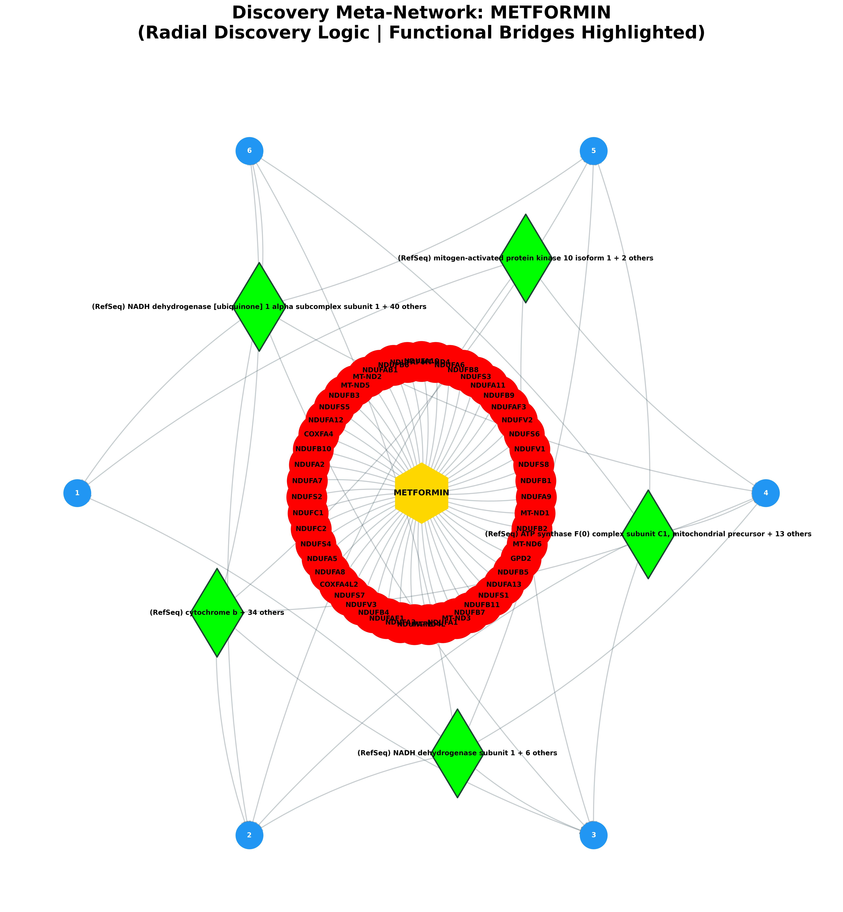
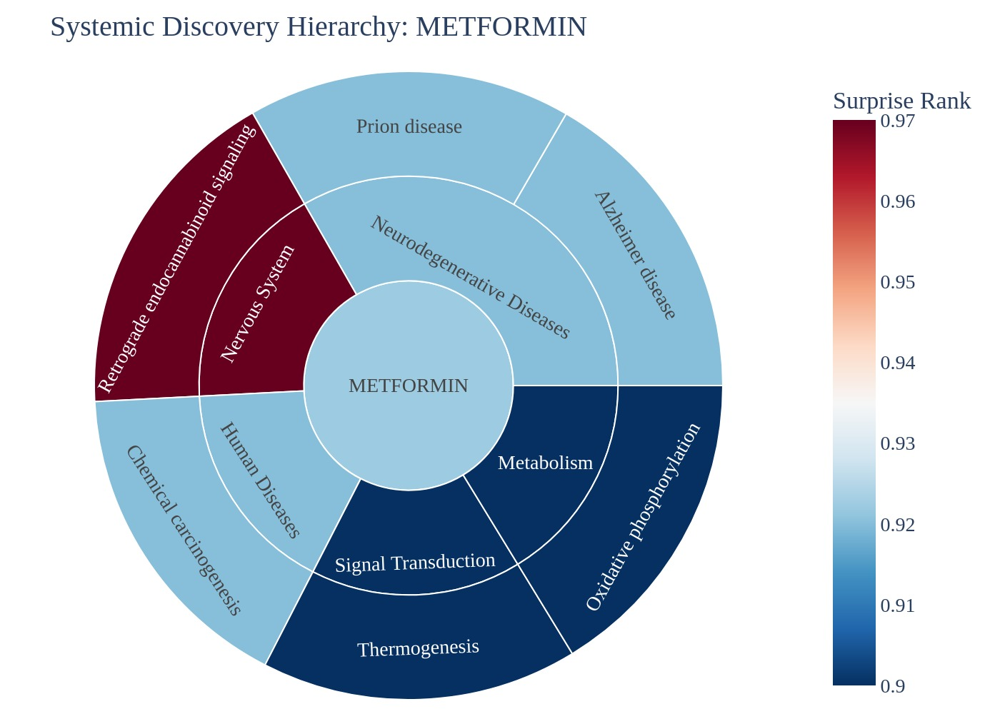
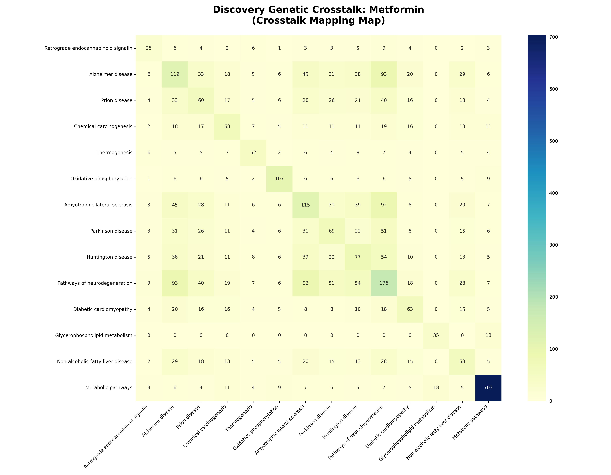

# Systemic Discovery & Predictive Report: Metformin

## EXECUTIVE SUMMARY
**Target Analyzed:** Metformin (CID: 4091)
**Discovery Scope:** Identified 6 novel disease links.

### 🗝️ Hub-and-Spoke Quick-Reference Map
The following table maps the numeric identifiers (1-15) displayed on the blue outcome nodes in the Meta-Network visual below to their assigned biological pathways.

| Node # | Pathway Discovery | Discovery Score |
|---|---|---|
| 1 | Retrograde endocannabinoid signaling | 0.97 |
| 2 | Alzheimer disease | 0.92 |
| 3 | Prion disease | 0.92 |
| 4 | Chemical carcinogenesis | 0.92 |
| 5 | Thermogenesis | 0.90 |
| 6 | Oxidative phosphorylation | 0.90 |

### Visual Discovery Portfolio

## I. NEW POTENTIAL DISEASE TARGETS
| Discovery Pathway | System Category | Predicted Effect | Discovery Score | Biological Mechanism Narrative |
|---|---|---|---|---|
| [Retrograde endocannabinoid signaling](https://www.kegg.jp/kegg-bin/show_pathway?hsa04723+hsa:4705+hsa:4712+hsa:4706+hsa:4536+hsa:4540+hsa:4709+hsa:4725+hsa:55967+hsa:4697+hsa:4716+hsa:4695+hsa:4701+hsa:4720+hsa:4717+hsa:4718+hsa:4724+hsa:4698+hsa:4702+hsa:56901+hsa:374291+hsa:4731+hsa:4710+hsa:4696+hsa:4539+hsa:4694+hsa:4537+hsa:4713+hsa:54539+hsa:4719+hsa:51079+hsa:4711+hsa:4541+hsa:4708+hsa:4535+hsa:4704+hsa:4707+hsa:4728+hsa:4723+hsa:4726+hsa:4729+hsa:4715+hsa:126328+hsa:4722+hsa:4714+hsa:4700+hsa:4538) | Nervous System | **Neutral** | 0.97 | The drug hits NDUFA10, NDUFAF4, which connects to the (RefSeq) NADH dehydrogenase [ubiquinone] 1 alpha subcomplex subunit 1 activator. In Retrograde endocannabinoid signaling, this bridge protein is responsible for executing downstream cellular signaling. By perturbing this bridge, the drug potentially modifies downstream systemic modulation. |
| [Alzheimer disease](https://www.kegg.jp/kegg-bin/show_pathway?hsa05010+hsa:4705+hsa:4712+hsa:4706+hsa:4536+hsa:4540+hsa:4709+hsa:4725+hsa:55967+hsa:4697+hsa:4716+hsa:4695+hsa:4701+hsa:4720+hsa:4717+hsa:4718+hsa:4724+hsa:4698+hsa:4702+hsa:56901+hsa:374291+hsa:4731+hsa:4710+hsa:4696+hsa:4539+hsa:4694+hsa:4537+hsa:4713+hsa:54539+hsa:4719+hsa:51079+hsa:4711+hsa:4541+hsa:4708+hsa:4535+hsa:4704+hsa:4707+hsa:4728+hsa:4723+hsa:4726+hsa:4729+hsa:4715+hsa:126328+hsa:4722+hsa:4714+hsa:4700+hsa:4538) | Neurodegenerative Diseases | **Neutral** | 0.92 | The drug hits NDUFA10, NDUFAF4, which connects to the (RefSeq) NADH dehydrogenase [ubiquinone] 1 alpha subcomplex subunit 1 activator. In Alzheimer disease, this bridge protein is responsible for executing downstream cellular signaling. By perturbing this bridge, the drug potentially modifies neuro-inflammation or synaptic plasticity. |
| [Prion disease](https://www.kegg.jp/kegg-bin/show_pathway?hsa05020+hsa:4705+hsa:4712+hsa:4706+hsa:4536+hsa:4540+hsa:4709+hsa:4725+hsa:55967+hsa:4697+hsa:4716+hsa:4695+hsa:4701+hsa:4720+hsa:4717+hsa:4718+hsa:4724+hsa:4698+hsa:4702+hsa:56901+hsa:374291+hsa:4731+hsa:4710+hsa:4696+hsa:4539+hsa:4694+hsa:4537+hsa:4713+hsa:54539+hsa:4719+hsa:51079+hsa:4711+hsa:4541+hsa:4708+hsa:4535+hsa:4704+hsa:4707+hsa:4728+hsa:4723+hsa:4726+hsa:4729+hsa:4715+hsa:126328+hsa:4722+hsa:4714+hsa:4700+hsa:4538) | Neurodegenerative Diseases | **Neutral** | 0.92 | The drug hits NDUFA10, NDUFAF4, which connects to the (RefSeq) NADH dehydrogenase [ubiquinone] 1 alpha subcomplex subunit 1 activator. In Prion disease, this bridge protein is responsible for executing downstream cellular signaling. By perturbing this bridge, the drug potentially modifies downstream systemic modulation. |
| [Chemical carcinogenesis](https://www.kegg.jp/kegg-bin/show_pathway?hsa05208+hsa:4705+hsa:4712+hsa:4706+hsa:4536+hsa:4540+hsa:4709+hsa:4725+hsa:55967+hsa:4697+hsa:4716+hsa:4695+hsa:4701+hsa:4720+hsa:4717+hsa:4718+hsa:4724+hsa:4698+hsa:4702+hsa:56901+hsa:374291+hsa:4731+hsa:4710+hsa:4696+hsa:4539+hsa:4694+hsa:4537+hsa:4713+hsa:54539+hsa:4719+hsa:51079+hsa:4711+hsa:4541+hsa:4708+hsa:4535+hsa:4704+hsa:4707+hsa:4728+hsa:4723+hsa:4726+hsa:4729+hsa:4715+hsa:126328+hsa:4722+hsa:4714+hsa:4700+hsa:4538) | Human Diseases | **Neutral** | 0.92 | The drug hits NDUFA10, NDUFAF4, which connects to the (RefSeq) NADH dehydrogenase [ubiquinone] 1 alpha subcomplex subunit 1 activator. In Chemical carcinogenesis, this bridge protein is responsible for executing downstream cellular signaling. By perturbing this bridge, the drug potentially modifies downstream systemic modulation. |
| [Thermogenesis](https://www.kegg.jp/kegg-bin/show_pathway?hsa04714+hsa:4705+hsa:29078+hsa:4712+hsa:4706+hsa:4536+hsa:4540+hsa:4709+hsa:4725+hsa:55967+hsa:4697+hsa:4716+hsa:4695+hsa:4701+hsa:4720+hsa:4717+hsa:4718+hsa:4724+hsa:4698+hsa:4702+hsa:56901+hsa:374291+hsa:4731+hsa:4710+hsa:51103+hsa:4696+hsa:91942+hsa:4539+hsa:4694+hsa:4537+hsa:4713+hsa:54539+hsa:4719+hsa:51079+hsa:4711+hsa:4541+hsa:4708+hsa:4535+hsa:4704+hsa:4707+hsa:4728+hsa:4723+hsa:4726+hsa:4729+hsa:25915+hsa:4715+hsa:126328+hsa:4722+hsa:4714+hsa:4700+hsa:4538) | Signal Transduction | **Neutral** | 0.90 | The drug hits NDUFA10, NDUFAF4, which connects to the (RefSeq) NADH dehydrogenase [ubiquinone] 1 alpha subcomplex subunit 1 activator. In Thermogenesis, this bridge protein is responsible for executing downstream cellular signaling. By perturbing this bridge, the drug potentially modifies downstream systemic modulation. |
| [Oxidative phosphorylation](https://www.kegg.jp/kegg-bin/show_pathway?hsa00190+hsa:4705+hsa:4712+hsa:4706+hsa:4536+hsa:4540+hsa:4709+hsa:4725+hsa:55967+hsa:4697+hsa:4716+hsa:4695+hsa:4701+hsa:4720+hsa:4717+hsa:4718+hsa:4724+hsa:4698+hsa:4702+hsa:56901+hsa:374291+hsa:4731+hsa:4710+hsa:4696+hsa:4539+hsa:4694+hsa:4537+hsa:4713+hsa:54539+hsa:4719+hsa:51079+hsa:4711+hsa:4541+hsa:4708+hsa:4535+hsa:4704+hsa:4707+hsa:4728+hsa:4723+hsa:4726+hsa:4729+hsa:4715+hsa:126328+hsa:4722+hsa:4714+hsa:4700+hsa:4538) | Metabolism | **Neutral** | 0.90 | The drug hits NDUFA10, NDUFAF4, which connects to the (RefSeq) NADH dehydrogenase [ubiquinone] 1 alpha subcomplex subunit 1 activator. In Oxidative phosphorylation, this bridge protein is responsible for executing downstream cellular signaling. By perturbing this bridge, the drug potentially modifies downstream systemic modulation. |

## II. THE MOLECULAR CONNECTORS
| Connector Protein (Bridge) | Pathway Count | Discovery Context |
|---|---|---|
| **(RefSeq) NADH dehydrogenase [ubiquinone] 1 alpha subcomplex subunit 1** (+ 40 others) | 13 | Alzheimer disease, Amyotrophic lateral sclerosis, Chemical carcinogenesis... |
| **(RefSeq) cytochrome b** (+ 34 others) | 12 | Alzheimer disease, Amyotrophic lateral sclerosis, Chemical carcinogenesis... |
| **(RefSeq) NADH dehydrogenase subunit 1** (+ 6 others) | 12 | Alzheimer disease, Amyotrophic lateral sclerosis, Chemical carcinogenesis... |
| **(RefSeq) ATP synthase F(0) complex subunit C1, mitochondrial precursor** (+ 13 others) | 11 | Alzheimer disease, Amyotrophic lateral sclerosis, Chemical carcinogenesis... |
| **(RefSeq) mitogen-activated protein kinase 10 isoform 1** (+ 2 others) | 9 | Alzheimer disease, Chemical carcinogenesis, Diabetic cardiomyopathy... |
| **(RefSeq) mitogen-activated protein kinase 11** (+ 3 others) | 8 | Amyotrophic lateral sclerosis, Chemical carcinogenesis, Diabetic cardiomyopathy... |
| **Hydrogen peroxide** (+ 1 others) | 7 | Alzheimer disease, Amyotrophic lateral sclerosis, Chemical carcinogenesis... |
| **(RefSeq) ADP/ATP translocase 1** (+ 6 others) | 7 | Alzheimer disease, Chemical carcinogenesis, Diabetic cardiomyopathy... |
| **(RefSeq) 26S proteasome complex subunit SEM1 isoform c** (+ 62 others) | 6 | Alzheimer disease, Amyotrophic lateral sclerosis, Huntington disease... |
| **(RefSeq) 1-phosphatidylinositol 4,5-bisphosphate phosphodiesterase beta-1 isoform a** (+ 3 others) | 6 | Alzheimer disease, Diabetic cardiomyopathy, Huntington disease... |

## III. DOWNSTREAM IMPACT ON CELLS
| Distal Pathway | System Branch | Surprise Rank |
|---|---|---|
| Amyotrophic lateral sclerosis | Neurodegenerative Diseases | 0.10 |
| Parkinson disease | Neurodegenerative Diseases | 0.10 |
| Huntington disease | Neurodegenerative Diseases | 0.10 |
| Pathways of neurodegeneration | Neurodegenerative Diseases | 0.10 |
| Diabetic cardiomyopathy | Human Diseases | 0.10 |
| Glycerophospholipid metabolism | Metabolism | 0.10 |
| Non-alcoholic fatty liver disease | Signal Transduction | 0.10 |
| Metabolic pathways | Metabolism | 0.10 |

--- 
## IV. KNOWN & EXPECTED EFFECTS (APPENDIX)
| Known Mechanism | Logic | Evidence |
|---|---|---|
| Amyotrophic lateral sclerosis | Primary Indication | High Confidence |
| Parkinson disease | Primary Indication | High Confidence |
| Huntington disease | Primary Indication | High Confidence |
| Pathways of neurodegeneration | Primary Indication | High Confidence |
| Diabetic cardiomyopathy | Primary Indication | High Confidence |
| Glycerophospholipid metabolism | Primary Indication | High Confidence |
| Non-alcoholic fatty liver disease | Primary Indication | High Confidence |
| Metabolic pathways | Primary Indication | High Confidence |

