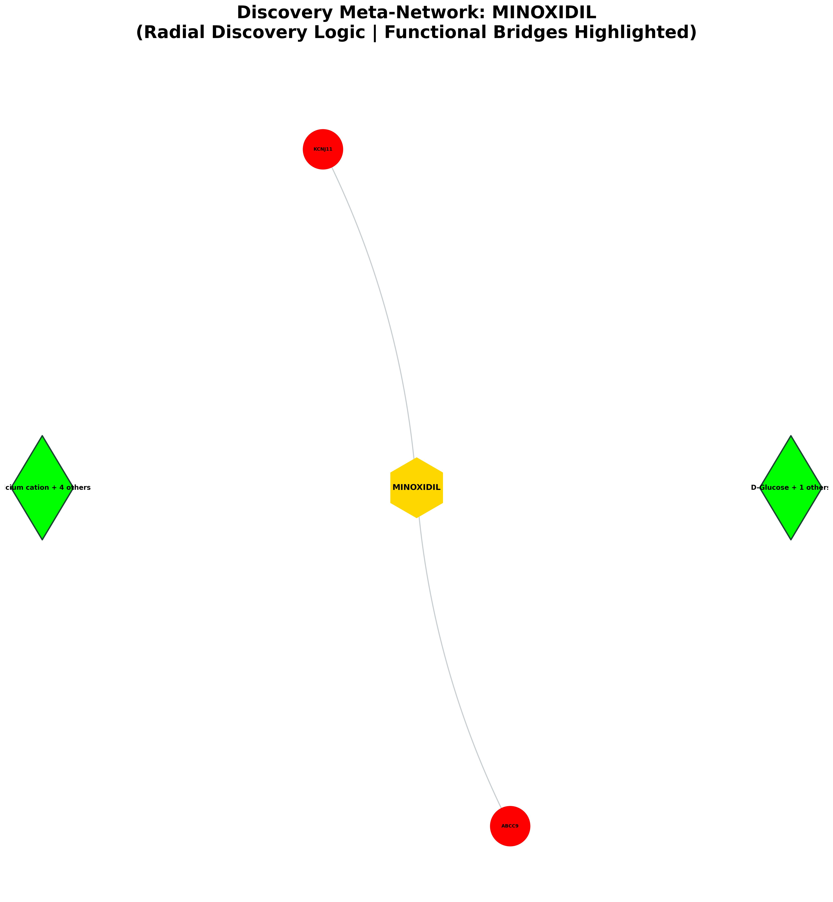
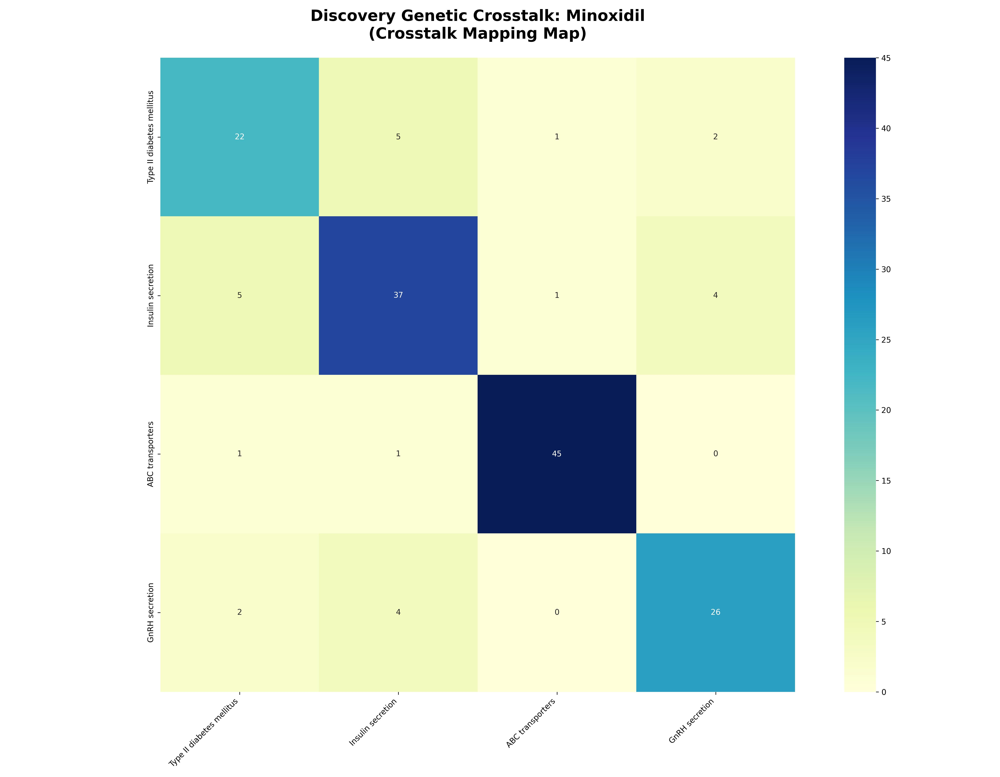

# Systemic Discovery & Predictive Report: Minoxidil

## EXECUTIVE SUMMARY
**Target Analyzed:** Minoxidil (CID: 4201)
**Discovery Scope:** Identified 0 novel disease links.

### 🗝️ Hub-and-Spoke Quick-Reference Map
The following table maps the numeric identifiers (1-15) displayed on the blue outcome nodes in the Meta-Network visual below to their assigned biological pathways.

| Node # | Pathway Discovery | Discovery Score |
|---|---|---|

### Visual Discovery Portfolio

## I. NEW POTENTIAL DISEASE TARGETS
| Discovery Pathway | System Category | Predicted Effect | Discovery Score | Z-Score (Specificity) | Biological Mechanism Narrative |
|---|---|---|---|---|---|

## II. THE MOLECULAR CONNECTORS
| Connector Protein (Bridge) | Pathway Count | Discovery Context |
|---|---|---|
| **Calcium cation** (+ 4 others) | 3 | GnRH secretion, Insulin secretion, Type II diabetes mellitus... |
| **D-Glucose** (+ 1 others) | 3 | ABC transporters, Insulin secretion, Type II diabetes mellitus... |

## III. DOWNSTREAM IMPACT ON CELLS
| Distal Pathway | System Branch | Discovery Score |
|---|---|---|
| GnRH secretion | Signal Transduction | 0.57 |
| Type II diabetes mellitus | Signal Transduction | 0.78 |
| ABC transporters | Genetic Information | 0.72 |
| Insulin secretion | Signal Transduction | 0.73 |

--- 
## IV. KNOWN & EXPECTED EFFECTS (APPENDIX)
| Known Mechanism | Logic | Evidence |
|---|---|---|

