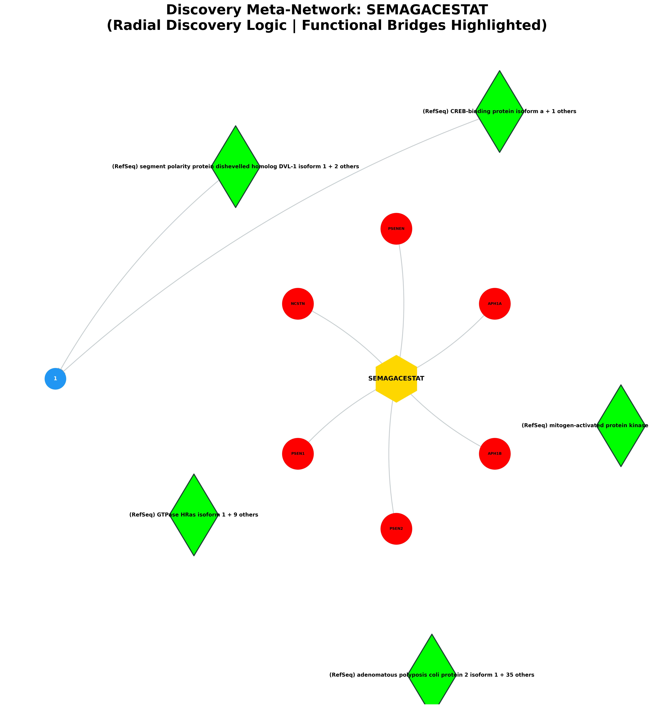
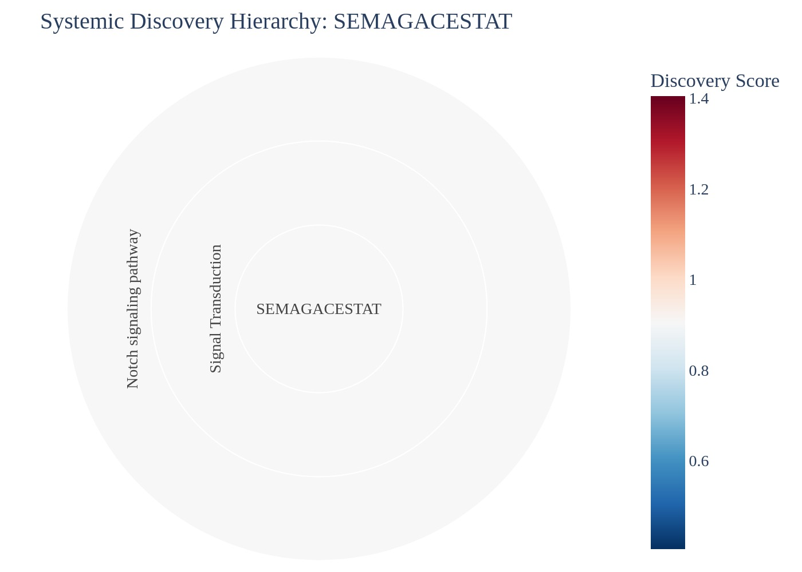
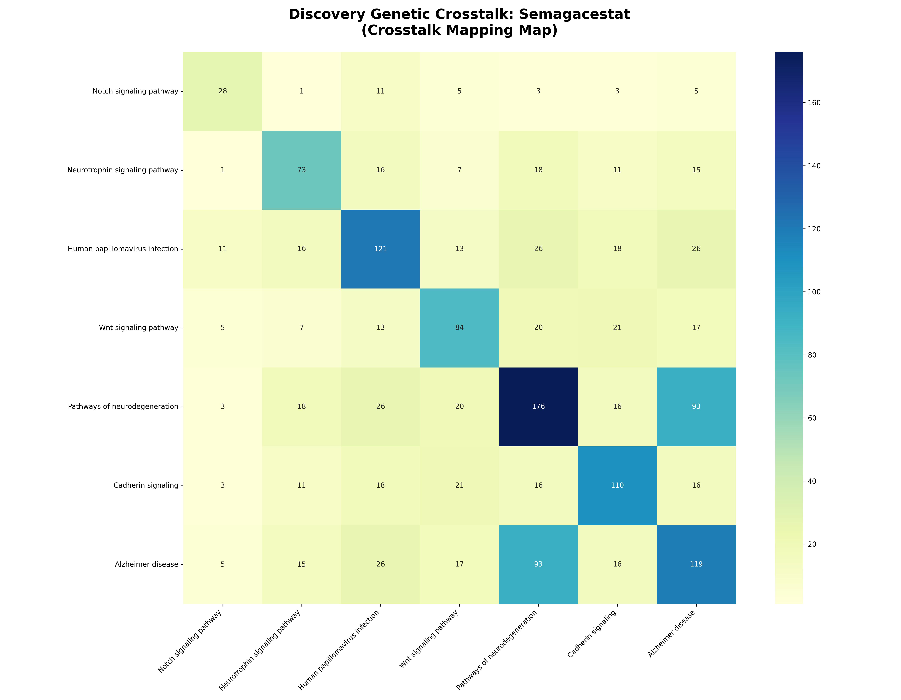

# Systemic Discovery & Predictive Report: Semagacestat

## EXECUTIVE SUMMARY
**Target Analyzed:** Semagacestat (CID: 9843750)
**Discovery Scope:** Identified 1 novel disease links.

### 🗝️ Hub-and-Spoke Quick-Reference Map
The following table maps the numeric identifiers (1-15) displayed on the blue outcome nodes in the Meta-Network visual below to their assigned biological pathways.

| Node # | Pathway Discovery | Discovery Score |
|---|---|---|
| 1 | Notch signaling pathway | 0.90 |

### Visual Discovery Portfolio

## I. NEW POTENTIAL DISEASE TARGETS
| Discovery Pathway | System Category | Predicted Effect | Discovery Score | Z-Score (Specificity) | Biological Mechanism Narrative |
|---|---|---|---|---|---|
| [Notch signaling pathway](https://www.kegg.jp/kegg-bin/show_pathway?hsa04330+hsa:55851+hsa:23385+hsa:5663+hsa:5664+hsa:83464+hsa:51107) | Signal Transduction | **Neutral** | 0.90 | 6.84 | The drug targets PSENEN, NCSTN, which influences the (RefSeq) segment polarity protein dishevelled homolog DVL-1 isoform 1 activator to modify executing downstream cellular signaling in Notch signaling pathway. |

## II. THE MOLECULAR CONNECTORS
| Connector Protein (Bridge) | Pathway Count | Discovery Context |
|---|---|---|
| **(RefSeq) segment polarity protein dishevelled homolog DVL-1 isoform 1** (+ 2 others) | 6 | Alzheimer disease, Cadherin signaling, Human papillomavirus infection... |
| **(RefSeq) GTPase HRas isoform 1** (+ 9 others) | 5 | Alzheimer disease, Cadherin signaling, Human papillomavirus infection... |
| **(RefSeq) adenomatous polyposis coli protein 2 isoform 1** (+ 35 others) | 5 | Alzheimer disease, Cadherin signaling, Human papillomavirus infection... |
| **(RefSeq) mitogen-activated protein kinase 10 isoform 1** (+ 2 others) | 5 | Alzheimer disease, Cadherin signaling, Neurotrophin signaling pathway... |
| **(RefSeq) CREB-binding protein isoform a** (+ 1 others) | 4 | Cadherin signaling, Human papillomavirus infection, Notch signaling pathway... |
| **(RefSeq) low-density lipoprotein receptor-related protein 5 isoform 1 precursor** (+ 1 others) | 4 | Alzheimer disease, Cadherin signaling, Pathways of neurodegeneration... |
| **(RefSeq) gamma-secretase subunit APH-1A isoform 1** (+ 3 others) | 3 | Alzheimer disease, Cadherin signaling, Notch signaling pathway... |
| **Phosphatidylinositol-3,4,5-trisphosphate** (+ 10 others) | 3 | Alzheimer disease, Human papillomavirus infection, Neurotrophin signaling pathway... |
| **(RefSeq) 26S proteasome regulatory subunit 4 isoform a** (+ 8 others) | 3 | Alzheimer disease, Human papillomavirus infection, Pathways of neurodegeneration... |
| **(RefSeq) apoptosis regulator BAX isoform alpha** (+ 1 others) | 3 | Human papillomavirus infection, Neurotrophin signaling pathway, Pathways of neurodegeneration... |

## III. DOWNSTREAM IMPACT ON CELLS
| Distal Pathway | System Branch | Discovery Score |
|---|---|---|
| Human papillomavirus infection | Human Diseases | 0.68 |
| Neurotrophin signaling pathway | Nervous System | 0.74 |
| Alzheimer disease | Neurodegenerative Diseases | 0.51 |
| Pathways of neurodegeneration | Neurodegenerative Diseases | 0.62 |
| Wnt signaling pathway | Signal Transduction | 0.65 |
| Cadherin signaling | Signal Transduction | 0.61 |

--- 
## IV. KNOWN & EXPECTED EFFECTS (APPENDIX)
| Known Mechanism | Logic | Evidence |
|---|---|---|

