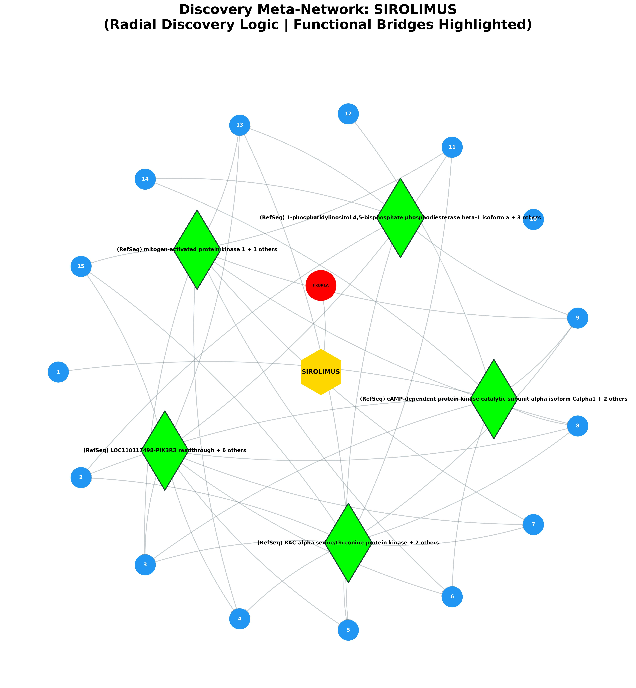
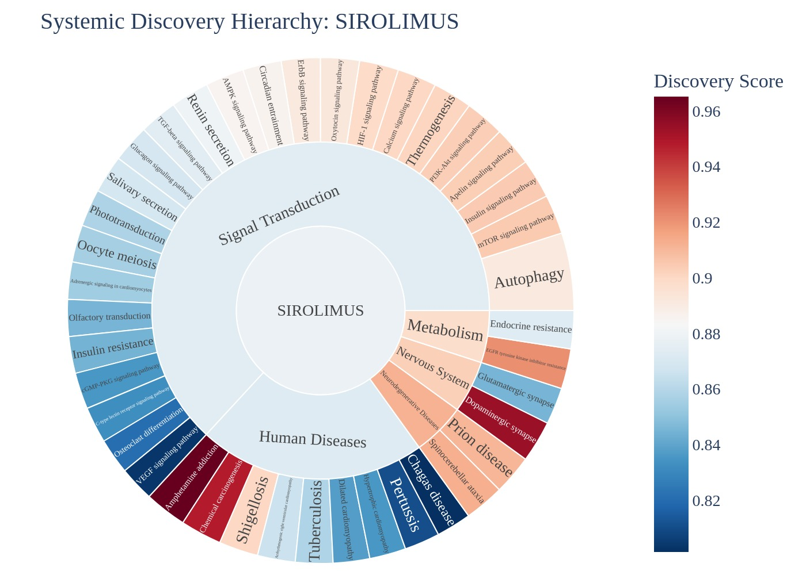
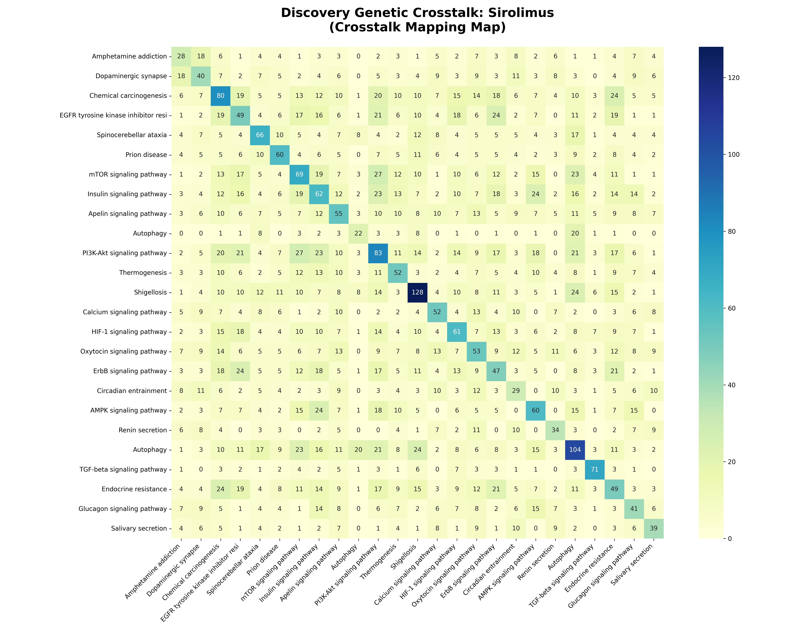

# Systemic Discovery & Predictive Report: Sirolimus

## EXECUTIVE SUMMARY
**Target Analyzed:** Sirolimus (CID: 5284616)
**Discovery Scope:** Identified 41 novel disease links.

### 🗝️ Hub-and-Spoke Quick-Reference Map
The following table maps the numeric identifiers (1-15) displayed on the blue outcome nodes in the Meta-Network visual below to their assigned biological pathways.

| Node # | Pathway Discovery | Discovery Score |
|---|---|---|
| 1 | Amphetamine addiction | 0.97 |
| 2 | Dopaminergic synapse | 0.95 |
| 3 | Chemical carcinogenesis | 0.95 |
| 4 | EGFR tyrosine kinase inhibitor resistance | 0.92 |
| 5 | Spinocerebellar ataxia | 0.91 |
| 6 | Prion disease | 0.91 |
| 7 | mTOR signaling pathway | 0.90 |
| 8 | Insulin signaling pathway | 0.90 |
| 9 | Apelin signaling pathway | 0.90 |
| 10 | Autophagy | 0.90 |
| 11 | PI3K-Akt signaling pathway | 0.90 |
| 12 | Thermogenesis | 0.90 |
| 13 | Shigellosis | 0.90 |
| 14 | Calcium signaling pathway | 0.90 |
| 15 | HIF-1 signaling pathway | 0.90 |

### Visual Discovery Portfolio

## I. NEW POTENTIAL DISEASE TARGETS
| Discovery Pathway | System Category | Predicted Effect | Discovery Score | Z-Score (Specificity) | Biological Mechanism Narrative |
|---|---|---|---|---|---|
| [Amphetamine addiction](https://www.kegg.jp/kegg-bin/show_pathway?hsa05031+hsa:5534+hsa:808+hsa:810+hsa:51806+hsa:91860+hsa:163688+hsa:5530) | Human Diseases | **Neutral** | 0.97 | 3.19 | The drug targets FKBP1A, which influences the (RefSeq) cAMP-dependent protein kinase catalytic subunit alpha isoform Calpha1 activator to modify executing downstream cellular signaling in Amphetamine addiction. |
| [Dopaminergic synapse](https://www.kegg.jp/kegg-bin/show_pathway?hsa04728+hsa:808+hsa:810+hsa:51806+hsa:91860+hsa:163688+hsa:5530) | Nervous System | **Neutral** | 0.95 | 2.72 | The drug targets FKBP1A, which influences the (RefSeq) RAC-alpha serine/threonine-protein kinase activator to modify executing downstream cellular signaling in Dopaminergic synapse. |
| [Chemical carcinogenesis](https://www.kegg.jp/kegg-bin/show_pathway?hsa05207+hsa:2475+hsa:6198+hsa:779+hsa:1978) | Human Diseases | **Neutral** | 0.95 | 2.53 | The drug targets FKBP1A, which influences the (RefSeq) mitogen-activated protein kinase 1 activator to modify is a member of the mitogen-activated protein kinase (MAPK) family in Chemical carcinogenesis. |
| [EGFR tyrosine kinase inhibitor resistance](https://www.kegg.jp/kegg-bin/show_pathway?hsa01521+hsa:2475+hsa:6198+hsa:1977+hsa:1978) | Metabolism | **Neutral** | 0.92 | 4.87 | The drug targets FKBP1A, which influences the (RefSeq) mitogen-activated protein kinase 1 activator to modify is a member of the mitogen-activated protein kinase (MAPK) family in EGFR tyrosine kinase inhibitor resistance. |
| [Spinocerebellar ataxia](https://www.kegg.jp/kegg-bin/show_pathway?hsa05017+hsa:6261+hsa:2475) | Neurodegenerative Diseases | **Neutral** | 0.91 | 1.78 | The drug targets FKBP1A, which influences the (RefSeq) LOC110117498-PIK3R3 readthrough activator to modify this locus represents naturally occurring readthrough transcription between the neighboring genes LOC110117498 and PIK3R3 in Spinocerebellar ataxia. |
| [Prion disease](https://www.kegg.jp/kegg-bin/show_pathway?hsa05020+hsa:6261+hsa:5534+hsa:6262+hsa:5530+hsa:779+hsa:6263) | Neurodegenerative Diseases | **Neutral** | 0.91 | 1.75 | The drug targets FKBP1A, which influences the (RefSeq) mitogen-activated protein kinase 1 activator to modify is a member of the mitogen-activated protein kinase (MAPK) family in Prion disease. |
| [mTOR signaling pathway](https://www.kegg.jp/kegg-bin/show_pathway?hsa04150+hsa:2475+hsa:57521+hsa:64223+hsa:6198+hsa:1977+hsa:253260+hsa:1978) | Signal Transduction | **Neutral** | 0.90 | 7.63 | The drug targets FKBP1A, which influences the (RefSeq) mitogen-activated protein kinase 1 activator to modify is a member of the mitogen-activated protein kinase (MAPK) family in mTOR signaling pathway. |
| [Insulin signaling pathway](https://www.kegg.jp/kegg-bin/show_pathway?hsa04910+hsa:2475+hsa:57521+hsa:808+hsa:810+hsa:51806+hsa:91860+hsa:163688+hsa:6198+hsa:1977+hsa:1978) | Signal Transduction | **Neutral** | 0.90 | 7.40 | The drug targets FKBP1A, which influences the (RefSeq) mitogen-activated protein kinase 1 activator to modify is a member of the mitogen-activated protein kinase (MAPK) family in Insulin signaling pathway. |
| [Apelin signaling pathway](https://www.kegg.jp/kegg-bin/show_pathway?hsa04371+hsa:6261+hsa:2475+hsa:7046+hsa:808+hsa:810+hsa:51806+hsa:91860+hsa:163688+hsa:6262+hsa:6198+hsa:6263) | Signal Transduction | **Neutral** | 0.90 | 5.89 | The drug targets FKBP1A, which influences the (RefSeq) mitogen-activated protein kinase 1 activator to modify is a member of the mitogen-activated protein kinase (MAPK) family in Apelin signaling pathway. |
| [Autophagy](https://www.kegg.jp/kegg-bin/show_pathway?hsa04136+hsa:2475+hsa:57521+hsa:64223) | Signal Transduction | **Neutral** | 0.90 | 5.80 | The drug targets FKBP1A, which influences the (RefSeq) serine/threonine-protein phosphatase 2A catalytic subunit alpha isoform isoform 1 activator to modify executing downstream cellular signaling in Autophagy. |
| [PI3K-Akt signaling pathway](https://www.kegg.jp/kegg-bin/show_pathway?hsa04151+hsa:2475+hsa:57521+hsa:64223+hsa:6198+hsa:1977+hsa:1978) | Signal Transduction | **Neutral** | 0.90 | 5.76 | The drug targets FKBP1A, which influences the (RefSeq) mitogen-activated protein kinase 1 activator to modify is a member of the mitogen-activated protein kinase (MAPK) family in PI3K-Akt signaling pathway. |
| [Thermogenesis](https://www.kegg.jp/kegg-bin/show_pathway?hsa04714+hsa:2475+hsa:57521+hsa:64223+hsa:6198) | Signal Transduction | **Neutral** | 0.90 | 4.87 | The drug targets FKBP1A, which influences the (RefSeq) cAMP-dependent protein kinase catalytic subunit alpha isoform Calpha1 activator to modify executing downstream cellular signaling in Thermogenesis. |
| [Shigellosis](https://www.kegg.jp/kegg-bin/show_pathway?hsa05131+hsa:2475+hsa:57521+hsa:6198+hsa:11146) | Human Diseases | **Neutral** | 0.90 | 1.59 | The drug targets FKBP1A, which influences the (RefSeq) mitogen-activated protein kinase 1 activator to modify is a member of the mitogen-activated protein kinase (MAPK) family in Shigellosis. |
| [Calcium signaling pathway](https://www.kegg.jp/kegg-bin/show_pathway?hsa04020+hsa:6261+hsa:5534+hsa:808+hsa:810+hsa:51806+hsa:91860+hsa:163688+hsa:6262+hsa:5530+hsa:10345+hsa:779+hsa:6263) | Signal Transduction | **Neutral** | 0.90 | 4.62 | The drug targets FKBP1A, which influences the (RefSeq) cAMP-dependent protein kinase catalytic subunit alpha isoform Calpha1 activator to modify executing downstream cellular signaling in Calcium signaling pathway. |
| [HIF-1 signaling pathway](https://www.kegg.jp/kegg-bin/show_pathway?hsa04066+hsa:2475+hsa:6198+hsa:1977+hsa:1978) | Signal Transduction | **Neutral** | 0.90 | 4.38 | The drug targets FKBP1A, which influences the (RefSeq) mitogen-activated protein kinase 1 activator to modify is a member of the mitogen-activated protein kinase (MAPK) family in HIF-1 signaling pathway. |
| [Oxytocin signaling pathway](https://www.kegg.jp/kegg-bin/show_pathway?hsa04921+hsa:6261+hsa:5534+hsa:808+hsa:810+hsa:51806+hsa:91860+hsa:163688+hsa:6262+hsa:5530+hsa:779+hsa:6263) | Signal Transduction | **Neutral** | 0.89 | 3.65 | The drug targets FKBP1A, which influences the (RefSeq) mitogen-activated protein kinase 1 activator to modify is a member of the mitogen-activated protein kinase (MAPK) family in Oxytocin signaling pathway. |
| [ErbB signaling pathway](https://www.kegg.jp/kegg-bin/show_pathway?hsa04012+hsa:2475+hsa:6198+hsa:1978) | Signal Transduction | **Neutral** | 0.89 | 3.59 | The drug targets FKBP1A, which influences the (RefSeq) mitogen-activated protein kinase 1 activator to modify is a member of the mitogen-activated protein kinase (MAPK) family in ErbB signaling pathway. |
| [Circadian entrainment](https://www.kegg.jp/kegg-bin/show_pathway?hsa04713+hsa:6261+hsa:808+hsa:810+hsa:51806+hsa:91860+hsa:163688+hsa:6262+hsa:6263) | Signal Transduction | **Neutral** | 0.89 | 3.23 | The drug targets FKBP1A, which influences the (RefSeq) mitogen-activated protein kinase 1 activator to modify is a member of the mitogen-activated protein kinase (MAPK) family in Circadian entrainment. |
| [AMPK signaling pathway](https://www.kegg.jp/kegg-bin/show_pathway?hsa04152+hsa:2475+hsa:57521+hsa:6198+hsa:1978) | Signal Transduction | **Neutral** | 0.89 | 3.21 | The drug targets FKBP1A, which influences the (RefSeq) LOC110117498-PIK3R3 readthrough activator to modify this locus represents naturally occurring readthrough transcription between the neighboring genes LOC110117498 and PIK3R3 in AMPK signaling pathway. |
| [Renin secretion](https://www.kegg.jp/kegg-bin/show_pathway?hsa04924+hsa:5534+hsa:808+hsa:810+hsa:51806+hsa:91860+hsa:163688+hsa:5530+hsa:779) | Signal Transduction | **Neutral** | 0.88 | 2.93 | The drug targets FKBP1A, which influences the (RefSeq) cAMP-dependent protein kinase catalytic subunit alpha isoform Calpha1 activator to modify executing downstream cellular signaling in Renin secretion. |
| [Autophagy](https://www.kegg.jp/kegg-bin/show_pathway?hsa04140+hsa:2475+hsa:57521+hsa:64223+hsa:6198) | Signal Transduction | **Neutral** | 0.88 | 2.90 | The drug targets FKBP1A, which influences the (RefSeq) mitogen-activated protein kinase 1 activator to modify is a member of the mitogen-activated protein kinase (MAPK) family in Autophagy. |
| [TGF-beta signaling pathway](https://www.kegg.jp/kegg-bin/show_pathway?hsa04350+hsa:7046+hsa:90+hsa:6198+hsa:658) | Signal Transduction | **Neutral** | 0.87 | 2.72 | The drug targets FKBP1A, which influences the (RefSeq) mitogen-activated protein kinase 1 activator to modify is a member of the mitogen-activated protein kinase (MAPK) family in TGF-beta signaling pathway. |
| [Endocrine resistance](https://www.kegg.jp/kegg-bin/show_pathway?hsa01522+hsa:2475+hsa:6198) | Metabolism | **Neutral** | 0.87 | 2.15 | The drug targets FKBP1A, which influences the (RefSeq) mitogen-activated protein kinase 1 activator to modify is a member of the mitogen-activated protein kinase (MAPK) family in Endocrine resistance. |
| [Glucagon signaling pathway](https://www.kegg.jp/kegg-bin/show_pathway?hsa04922+hsa:5534+hsa:808+hsa:810+hsa:51806+hsa:91860+hsa:163688+hsa:5530) | Signal Transduction | **Neutral** | 0.87 | 2.56 | The drug targets FKBP1A, which influences the (RefSeq) RAC-alpha serine/threonine-protein kinase activator to modify executing downstream cellular signaling in Glucagon signaling pathway. |
| [Salivary secretion](https://www.kegg.jp/kegg-bin/show_pathway?hsa04970+hsa:808+hsa:810+hsa:51806+hsa:91860+hsa:163688+hsa:6263) | Signal Transduction | **Neutral** | 0.87 | 2.55 | The drug targets FKBP1A, which influences the (RefSeq) cAMP-dependent protein kinase catalytic subunit alpha isoform Calpha1 activator to modify executing downstream cellular signaling in Salivary secretion. |
| [Arrhythmogenic right ventricular cardiomyopathy](https://www.kegg.jp/kegg-bin/show_pathway?hsa05412+hsa:6262+hsa:779) | Human Diseases | **Neutral** | 0.87 | 1.16 | The drug targets FKBP1A, which influences the (RefSeq) voltage-dependent L-type calcium channel subunit alpha-1F isoform 1 activator to modify executing downstream cellular signaling in Arrhythmogenic right ventricular cardiomyopathy. |
| [Tuberculosis](https://www.kegg.jp/kegg-bin/show_pathway?hsa05152+hsa:5534+hsa:808+hsa:810+hsa:51806+hsa:91860+hsa:163688+hsa:5530) | Human Diseases | **Neutral** | 0.86 | 1.08 | The drug targets FKBP1A, which influences the (RefSeq) mitogen-activated protein kinase 1 activator to modify is a member of the mitogen-activated protein kinase (MAPK) family in Tuberculosis. |
| [Phototransduction](https://www.kegg.jp/kegg-bin/show_pathway?hsa04744+hsa:808+hsa:810+hsa:51806+hsa:91860+hsa:163688) | Signal Transduction | **Neutral** | 0.86 | 2.26 | The drug targets FKBP1A, which influences the (RefSeq) calmodulin-1 isoform 2 activator to modify phosphorylase kinase is a polymer of 16 subunits, four each of alpha, beta, gamma and delta in Phototransduction. |
| [Oocyte meiosis](https://www.kegg.jp/kegg-bin/show_pathway?hsa04114+hsa:5534+hsa:808+hsa:810+hsa:51806+hsa:91860+hsa:163688+hsa:5530) | Signal Transduction | **Neutral** | 0.86 | 2.21 | The drug targets FKBP1A, which influences the (RefSeq) mitogen-activated protein kinase 1 activator to modify is a member of the mitogen-activated protein kinase (MAPK) family in Oocyte meiosis. |
| [Adrenergic signaling in cardiomyocytes](https://www.kegg.jp/kegg-bin/show_pathway?hsa04261+hsa:808+hsa:810+hsa:51806+hsa:91860+hsa:163688+hsa:6262+hsa:779) | Signal Transduction | **Neutral** | 0.85 | 2.18 | The drug targets FKBP1A, which influences the (RefSeq) mitogen-activated protein kinase 1 activator to modify is a member of the mitogen-activated protein kinase (MAPK) family in Adrenergic signaling in cardiomyocytes. |
| [Olfactory transduction](https://www.kegg.jp/kegg-bin/show_pathway?hsa04740+hsa:808+hsa:810+hsa:51806+hsa:91860+hsa:163688) | Signal Transduction | **Neutral** | 0.85 | 1.99 | The drug targets FKBP1A, which influences the (RefSeq) cAMP-dependent protein kinase catalytic subunit alpha isoform Calpha1 activator to modify executing downstream cellular signaling in Olfactory transduction. |
| [Glutamatergic synapse](https://www.kegg.jp/kegg-bin/show_pathway?hsa04724+hsa:5534+hsa:5530) | Nervous System | **Neutral** | 0.84 | 0.94 | The drug targets FKBP1A, which influences the (RefSeq) mitogen-activated protein kinase 1 activator to modify is a member of the mitogen-activated protein kinase (MAPK) family in Glutamatergic synapse. |
| [Insulin resistance](https://www.kegg.jp/kegg-bin/show_pathway?hsa04931+hsa:2475+hsa:6198) | Signal Transduction | **Neutral** | 0.84 | 1.98 | The drug targets FKBP1A, which influences the (RefSeq) LOC110117498-PIK3R3 readthrough activator to modify this locus represents naturally occurring readthrough transcription between the neighboring genes LOC110117498 and PIK3R3 in Insulin resistance. |
| [Dilated cardiomyopathy](https://www.kegg.jp/kegg-bin/show_pathway?hsa05414+hsa:6262+hsa:779) | Human Diseases | **Neutral** | 0.84 | 0.87 | The drug targets FKBP1A, which influences the (RefSeq) cAMP-dependent protein kinase catalytic subunit alpha isoform Calpha1 activator to modify executing downstream cellular signaling in Dilated cardiomyopathy. |
| [cGMP-PKG signaling pathway](https://www.kegg.jp/kegg-bin/show_pathway?hsa04022+hsa:5534+hsa:808+hsa:810+hsa:51806+hsa:91860+hsa:163688+hsa:5530+hsa:779) | Signal Transduction | **Neutral** | 0.84 | 1.82 | The drug targets FKBP1A, which influences the (RefSeq) mitogen-activated protein kinase 1 activator to modify is a member of the mitogen-activated protein kinase (MAPK) family in cGMP-PKG signaling pathway. |
| [Hypertrophic cardiomyopathy](https://www.kegg.jp/kegg-bin/show_pathway?hsa05410+hsa:6262+hsa:779) | Human Diseases | **Neutral** | 0.84 | 0.85 | The drug targets FKBP1A, which influences the (RefSeq) voltage-dependent L-type calcium channel subunit alpha-1F isoform 1 activator to modify executing downstream cellular signaling in Hypertrophic cardiomyopathy. |
| [C-type lectin receptor signaling pathway](https://www.kegg.jp/kegg-bin/show_pathway?hsa04625+hsa:5534+hsa:808+hsa:810+hsa:51806+hsa:91860+hsa:163688+hsa:5530) | Signal Transduction | **Neutral** | 0.83 | 1.77 | The drug targets FKBP1A, which influences the (RefSeq) mitogen-activated protein kinase 1 activator to modify is a member of the mitogen-activated protein kinase (MAPK) family in C-type lectin receptor signaling pathway. |
| [Osteoclast differentiation](https://www.kegg.jp/kegg-bin/show_pathway?hsa04380+hsa:7046+hsa:5534+hsa:5530) | Signal Transduction | **Neutral** | 0.82 | 1.59 | The drug targets FKBP1A, which influences the (RefSeq) mitogen-activated protein kinase 1 activator to modify is a member of the mitogen-activated protein kinase (MAPK) family in Osteoclast differentiation. |
| [Pertussis](https://www.kegg.jp/kegg-bin/show_pathway?hsa05133+hsa:808+hsa:810+hsa:51806+hsa:91860+hsa:163688) | Human Diseases | **Neutral** | 0.81 | 0.62 | The drug targets FKBP1A, which influences the (RefSeq) mitogen-activated protein kinase 1 activator to modify is a member of the mitogen-activated protein kinase (MAPK) family in Pertussis. |
| [VEGF signaling pathway](https://www.kegg.jp/kegg-bin/show_pathway?hsa04370+hsa:5534+hsa:5530) | Signal Transduction | **Neutral** | 0.80 | 1.36 | The drug targets FKBP1A, which influences the (RefSeq) mitogen-activated protein kinase 1 activator to modify is a member of the mitogen-activated protein kinase (MAPK) family in VEGF signaling pathway. |
| [Chagas disease](https://www.kegg.jp/kegg-bin/show_pathway?hsa05142+hsa:7046) | Human Diseases | **Neutral** | 0.80 | 0.54 | The drug targets FKBP1A, which influences the (RefSeq) mitogen-activated protein kinase 1 activator to modify is a member of the mitogen-activated protein kinase (MAPK) family in Chagas disease. |

## II. THE MOLECULAR CONNECTORS
| Connector Protein (Bridge) | Pathway Count | Discovery Context |
|---|---|---|
| **(RefSeq) mitogen-activated protein kinase 1** (+ 1 others) | 84 | AGE-RAGE signaling pathway in diabetic complications, Acute myeloid leukemia, Adherens junction... |
| **(RefSeq) LOC110117498-PIK3R3 readthrough** (+ 6 others) | 73 | AGE-RAGE signaling pathway in diabetic complications, AMPK signaling pathway, Acute myeloid leukemia... |
| **(RefSeq) RAC-alpha serine/threonine-protein kinase** (+ 2 others) | 73 | AGE-RAGE signaling pathway in diabetic complications, AMPK signaling pathway, Acute myeloid leukemia... |
| **(RefSeq) cAMP-dependent protein kinase catalytic subunit alpha isoform Calpha1** (+ 2 others) | 52 | Adrenergic signaling in cardiomyocytes, Alcoholism, Aldosterone synthesis and secretion... |
| **(RefSeq) 1-phosphatidylinositol 4,5-bisphosphate phosphodiesterase beta-1 isoform a** (+ 3 others) | 48 | AGE-RAGE signaling pathway in diabetic complications, Adrenergic signaling in cardiomyocytes, Aldosterone synthesis and secretion... |
| **(RefSeq) mitogen-activated protein kinase 10 isoform 1** (+ 2 others) | 46 | AGE-RAGE signaling pathway in diabetic complications, Adipocytokine signaling pathway, Alzheimer disease... |
| **(RefSeq) calmodulin-1 isoform 2** (+ 6 others) | 43 | Adrenergic signaling in cardiomyocytes, Alcoholism, Aldosterone synthesis and secretion... |
| **(RefSeq) mitogen-activated protein kinase 11** (+ 3 others) | 40 | AGE-RAGE signaling pathway in diabetic complications, Adrenergic signaling in cardiomyocytes, Amyotrophic lateral sclerosis... |
| **(RefSeq) adenylate cyclase type 4** (+ 2 others) | 38 | Adrenergic signaling in cardiomyocytes, Aldosterone synthesis and secretion, Apelin signaling pathway... |
| **(RefSeq) son of sevenless homolog 1 isoform 1** (+ 1 others) | 37 | Acute myeloid leukemia, Alcoholism, B cell receptor signaling pathway... |

## III. DOWNSTREAM IMPACT ON CELLS
| Distal Pathway | System Branch | Discovery Score |
|---|---|---|
| Fc gamma R-mediated phagocytosis | Signal Transduction | 0.73 |
| Human papillomavirus infection | Human Diseases | 0.47 |
| Pancreatic cancer | Human Diseases | 0.53 |
| Signaling pathways regulating pluripotency of stem cells | Signal Transduction | 0.20 |
| Endocytosis | Signal Transduction | 0.65 |
| Cytokine-cytokine receptor interaction | Signal Transduction | 0.67 |
| Alzheimer disease | Neurodegenerative Diseases | 0.51 |
| GnRH signaling pathway | Signal Transduction | 0.76 |
| Melanogenesis | Signal Transduction | 0.78 |
| Diabetic cardiomyopathy | Human Diseases | 0.53 |
| Chronic myeloid leukemia | Human Diseases | 0.39 |
| AGE-RAGE signaling pathway in diabetic complications | Signal Transduction | 0.37 |
| Pathways of neurodegeneration | Neurodegenerative Diseases | 0.47 |
| Lipid and atherosclerosis | Human Diseases | 0.38 |
| Hormone signaling | Signal Transduction | 0.53 |

--- 
## IV. KNOWN & EXPECTED EFFECTS (APPENDIX)
| Known Mechanism | Logic | Evidence |
|---|---|---|
| Signaling pathways regulating pluripotency of stem cells | Primary Indication | High Confidence |

