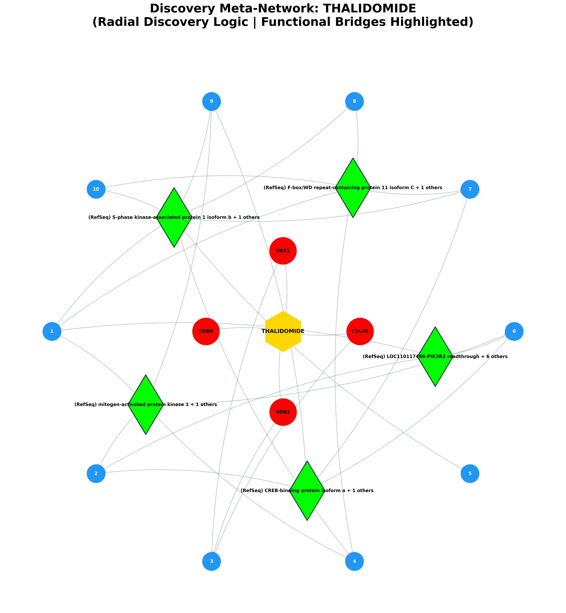
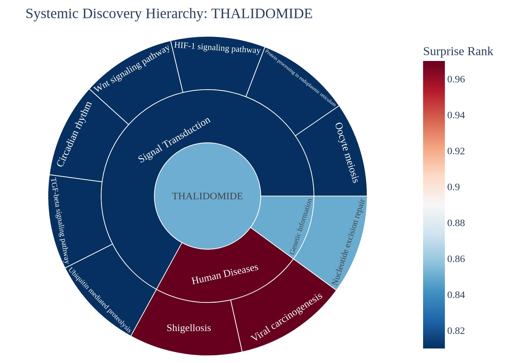
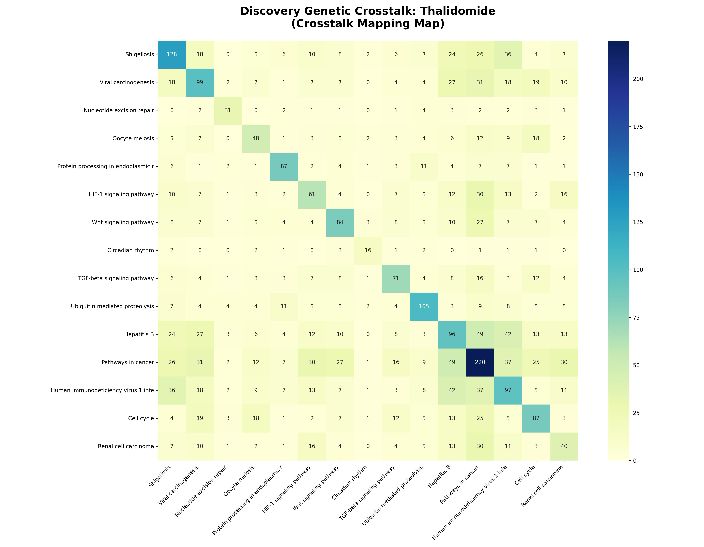

# Systemic Discovery & Predictive Report: Thalidomide

## EXECUTIVE SUMMARY
**Target Analyzed:** Thalidomide (CID: 5426)
**Discovery Scope:** Identified 10 novel disease links.

### 🗝️ Hub-and-Spoke Quick-Reference Map
The following table maps the numeric identifiers (1-15) displayed on the blue outcome nodes in the Meta-Network visual below to their assigned biological pathways.

| Node # | Pathway Discovery | Discovery Score |
|---|---|---|
| 1 | Shigellosis | 0.97 |
| 2 | Viral carcinogenesis | 0.97 |
| 3 | Nucleotide excision repair | 0.85 |
| 4 | Oocyte meiosis | 0.81 |
| 5 | Protein processing in endoplasmic reticulum | 0.81 |
| 6 | HIF-1 signaling pathway | 0.81 |
| 7 | Wnt signaling pathway | 0.81 |
| 8 | Circadian rhythm | 0.81 |
| 9 | TGF-beta signaling pathway | 0.81 |
| 10 | Ubiquitin mediated proteolysis | 0.81 |

### Visual Discovery Portfolio

## I. NEW POTENTIAL DISEASE TARGETS
| Discovery Pathway | System Category | Predicted Effect | Discovery Score | Biological Mechanism Narrative |
|---|---|---|---|---|
| [Shigellosis](https://www.kegg.jp/kegg-bin/show_pathway?hsa05131+hsa:9978) | Human Diseases | **Neutral** | 0.97 | The drug hits RBX1, CRBN, which connects to the (RefSeq) S-phase kinase-associated protein 1 isoform b activator. In Shigellosis, this bridge protein is responsible for This gene encodes a non-receptor tyrosine kinase that plays a central role in cytokine and growth factor signalling. By perturbing this bridge, the drug potentially modifies downstream systemic modulation. |
| [Viral carcinogenesis](https://www.kegg.jp/kegg-bin/show_pathway?hsa05203+hsa:1642) | Human Diseases | **Neutral** | 0.97 | The drug hits RBX1, CRBN, which connects to the (RefSeq) mitogen-activated protein kinase 1 activator. In Viral carcinogenesis, this bridge protein is responsible for The protein encoded by this gene is a member of the mitogen-activated protein kinase (MAPK) family. By perturbing this bridge, the drug potentially modifies downstream systemic modulation. |
| [Nucleotide excision repair](https://www.kegg.jp/kegg-bin/show_pathway?hsa03420+hsa:9978+hsa:1642+hsa:8451) | Genetic Information | **Neutral** | 0.85 | The drug hits RBX1, CRBN, which connects to the (RefSeq) cullin-4A isoform 1 activator. In Nucleotide excision repair, this bridge protein is responsible for executing downstream cellular signaling. By perturbing this bridge, the drug potentially modifies downstream systemic modulation. |
| [Oocyte meiosis](https://www.kegg.jp/kegg-bin/show_pathway?hsa04114+hsa:9978) | Signal Transduction | **Neutral** | 0.81 | The drug hits RBX1, CRBN, which connects to the (RefSeq) S-phase kinase-associated protein 1 isoform b activator. In Oocyte meiosis, this bridge protein is responsible for This gene encodes a non-receptor tyrosine kinase that plays a central role in cytokine and growth factor signalling. By perturbing this bridge, the drug potentially modifies downstream systemic modulation. |
| [Protein processing in endoplasmic reticulum](https://www.kegg.jp/kegg-bin/show_pathway?hsa04141+hsa:9978) | Signal Transduction | **Neutral** | 0.81 | The drug hits RBX1, CRBN, which connects to the (RefSeq) S-phase kinase-associated protein 1 isoform b activator. In Protein processing in endoplasmic reticulum, this bridge protein is responsible for This gene encodes a non-receptor tyrosine kinase that plays a central role in cytokine and growth factor signalling. By perturbing this bridge, the drug potentially modifies downstream systemic modulation. |
| [HIF-1 signaling pathway](https://www.kegg.jp/kegg-bin/show_pathway?hsa04066+hsa:9978) | Signal Transduction | **Neutral** | 0.81 | The drug hits RBX1, CRBN, which connects to the (RefSeq) mitogen-activated protein kinase 1 activator. In HIF-1 signaling pathway, this bridge protein is responsible for The protein encoded by this gene is a member of the mitogen-activated protein kinase (MAPK) family. By perturbing this bridge, the drug potentially modifies downstream systemic modulation. |
| [Wnt signaling pathway](https://www.kegg.jp/kegg-bin/show_pathway?hsa04310+hsa:9978) | Signal Transduction | **Neutral** | 0.81 | The drug hits RBX1, CRBN, which connects to the (RefSeq) S-phase kinase-associated protein 1 isoform b activator. In Wnt signaling pathway, this bridge protein is responsible for This gene encodes a non-receptor tyrosine kinase that plays a central role in cytokine and growth factor signalling. By perturbing this bridge, the drug potentially modifies downstream systemic modulation. |
| [Circadian rhythm](https://www.kegg.jp/kegg-bin/show_pathway?hsa04710+hsa:9978) | Signal Transduction | **Neutral** | 0.81 | The drug hits RBX1, CRBN, which connects to the (RefSeq) S-phase kinase-associated protein 1 isoform b activator. In Circadian rhythm, this bridge protein is responsible for This gene encodes a non-receptor tyrosine kinase that plays a central role in cytokine and growth factor signalling. By perturbing this bridge, the drug potentially modifies downstream systemic modulation. |
| [TGF-beta signaling pathway](https://www.kegg.jp/kegg-bin/show_pathway?hsa04350+hsa:9978) | Signal Transduction | **Neutral** | 0.81 | The drug hits RBX1, CRBN, which connects to the (RefSeq) S-phase kinase-associated protein 1 isoform b activator. In TGF-beta signaling pathway, this bridge protein is responsible for This gene encodes a non-receptor tyrosine kinase that plays a central role in cytokine and growth factor signalling. By perturbing this bridge, the drug potentially modifies downstream systemic modulation. |
| [Ubiquitin mediated proteolysis](https://www.kegg.jp/kegg-bin/show_pathway?hsa04120+hsa:9978+hsa:1642+hsa:8451) | Signal Transduction | **Neutral** | 0.81 | The drug hits RBX1, CRBN, which connects to the (RefSeq) S-phase kinase-associated protein 1 isoform b activator. In Ubiquitin mediated proteolysis, this bridge protein is responsible for This gene encodes a non-receptor tyrosine kinase that plays a central role in cytokine and growth factor signalling. By perturbing this bridge, the drug potentially modifies downstream systemic modulation. |

## II. THE MOLECULAR CONNECTORS
| Connector Protein (Bridge) | Pathway Count | Discovery Context |
|---|---|---|
| **(RefSeq) S-phase kinase-associated protein 1 isoform b** (+ 1 others) | 10 | Cell cycle, Circadian rhythm, Human immunodeficiency virus 1 infection... |
| **(RefSeq) mitogen-activated protein kinase 1** (+ 1 others) | 9 | HIF-1 signaling pathway, Hepatitis B, Human immunodeficiency virus 1 infection... |
| **(RefSeq) CREB-binding protein isoform a** (+ 1 others) | 8 | Cell cycle, HIF-1 signaling pathway, Hepatitis B... |
| **(RefSeq) LOC110117498-PIK3R3 readthrough** (+ 6 others) | 7 | HIF-1 signaling pathway, Hepatitis B, Human immunodeficiency virus 1 infection... |
| **(RefSeq) F-box/WD repeat-containing protein 11 isoform C** (+ 1 others) | 6 | Circadian rhythm, Human immunodeficiency virus 1 infection, Oocyte meiosis... |
| **(RefSeq) mitogen-activated protein kinase 10 isoform 1** (+ 2 others) | 6 | Hepatitis B, Human immunodeficiency virus 1 infection, Pathways in cancer... |
| **(RefSeq) RAC-alpha serine/threonine-protein kinase** (+ 2 others) | 6 | HIF-1 signaling pathway, Hepatitis B, Human immunodeficiency virus 1 infection... |
| **(RefSeq) nuclear factor NF-kappa-B p105 subunit isoform 2 proprotein** (+ 1 others) | 6 | HIF-1 signaling pathway, Hepatitis B, Human immunodeficiency virus 1 infection... |
| **(RefSeq) G1/S-specific cyclin-E1 isoform 1** (+ 2 others) | 5 | Cell cycle, Hepatitis B, Oocyte meiosis... |
| **(RefSeq) elongin-B isoform a** (+ 1 others) | 5 | HIF-1 signaling pathway, Human immunodeficiency virus 1 infection, Pathways in cancer... |

## III. DOWNSTREAM IMPACT ON CELLS
| Distal Pathway | System Branch | Surprise Rank |
|---|---|---|
| Hepatitis B | Human Diseases | 0.10 |
| Pathways in cancer | Human Diseases | 0.10 |
| Human immunodeficiency virus 1 infection | Human Diseases | 0.10 |
| Cell cycle | Signal Transduction | 0.10 |
| Renal cell carcinoma | Human Diseases | 0.10 |

--- 
## IV. KNOWN & EXPECTED EFFECTS (APPENDIX)
| Known Mechanism | Logic | Evidence |
|---|---|---|
| Hepatitis B | Primary Indication | High Confidence |
| Pathways in cancer | Primary Indication | High Confidence |
| Human immunodeficiency virus 1 infection | Primary Indication | High Confidence |
| Cell cycle | Primary Indication | High Confidence |
| Renal cell carcinoma | Primary Indication | High Confidence |

