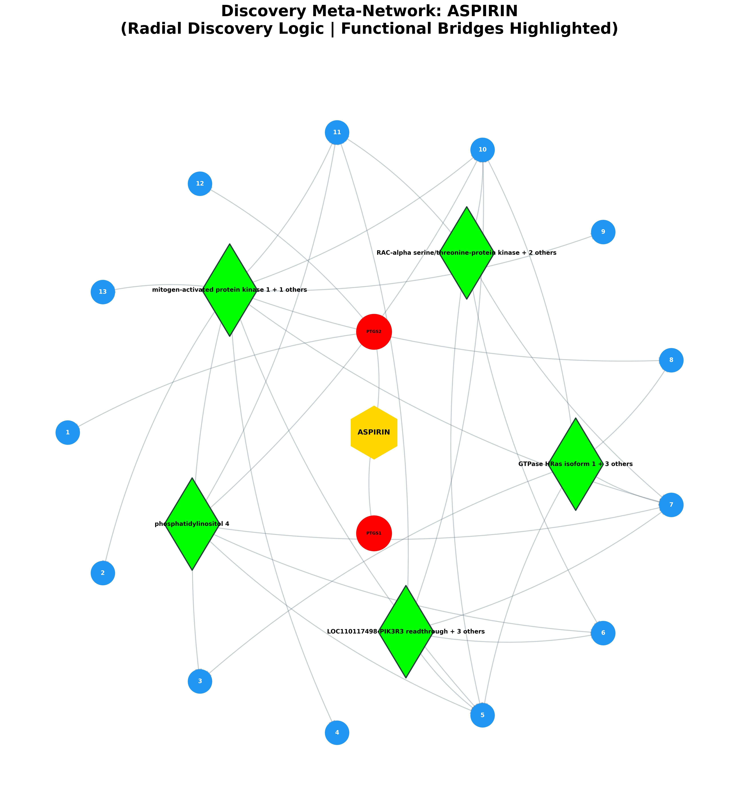
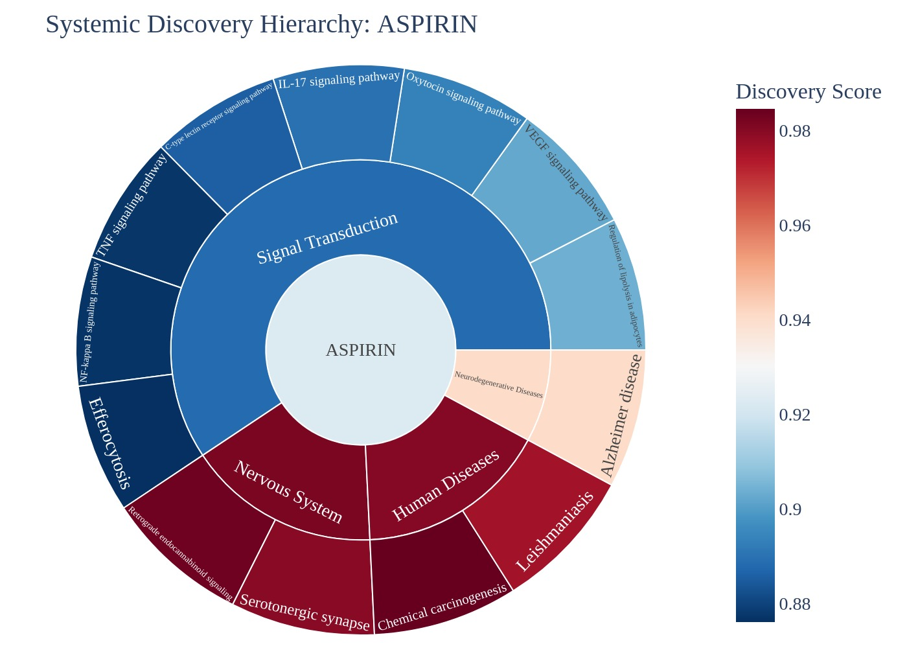
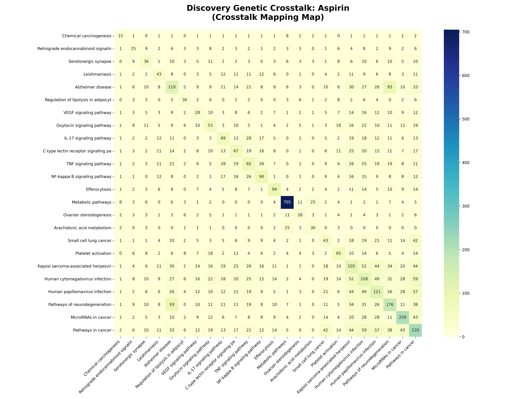

# Systemic Discovery & Predictive Report: Aspirin

## EXECUTIVE SUMMARY
**Target Analyzed:** Aspirin (CID: 2244)
**Discovery Scope:** Identified 13 novel disease links.

### 🗝️ Hub-and-Spoke Quick-Reference Map
The following table maps the numeric identifiers (1-15) displayed on the blue outcome nodes in the Meta-Network visual below to their assigned biological pathways.

| Node # | Pathway Discovery | Discovery Score |
|---|---|---|
| 1 | Chemical carcinogenesis | 0.98 |
| 2 | Retrograde endocannabinoid signaling | 0.98 |
| 3 | Serotonergic synapse | 0.98 |
| 4 | Leishmaniasis | 0.98 |
| 5 | Alzheimer disease | 0.94 |
| 6 | Regulation of lipolysis in adipocytes | 0.90 |
| 7 | VEGF signaling pathway | 0.90 |
| 8 | Oxytocin signaling pathway | 0.89 |
| 9 | IL-17 signaling pathway | 0.89 |
| 10 | C-type lectin receptor signaling pathway | 0.89 |
| 11 | TNF signaling pathway | 0.88 |
| 12 | NF-kappa B signaling pathway | 0.88 |
| 13 | Efferocytosis | 0.88 |

### Visual Discovery Portfolio

## I. NEW POTENTIAL DISEASE TARGETS
| Discovery Pathway | System Category | Predicted Effect | Discovery Score | Z-Score (Specificity) | Biological Mechanism Narrative |
|---|---|---|---|---|---|
| [Chemical carcinogenesis](https://www.kegg.jp/kegg-bin/show_pathway?hsa05204+hsa:5743) | Human Diseases | **Inhibited (Predicted)** | 0.98 | 7.00 | The drug targets PTGS2, PTGS1, which influences the cytochrome P450 2C19 activator to modify a member of the cytochrome P450 superfamily of enzymes in Chemical carcinogenesis. |
| [Retrograde endocannabinoid signaling](https://www.kegg.jp/kegg-bin/show_pathway?hsa04723+hsa:5743) | Nervous System | **Inhibited (Predicted)** | 0.98 | 5.79 | The drug targets PTGS2, PTGS1, which influences the mitogen-activated protein kinase 1 activator to modify a member of the MAP kinase family in Retrograde endocannabinoid signaling. |
| [Serotonergic synapse](https://www.kegg.jp/kegg-bin/show_pathway?hsa04726+hsa:5743+hsa:5742) | Nervous System | **Activated (Disinhibition)** | 0.98 | 4.55 | The drug targets PTGS2, PTGS1, which influences the mitogen-activated protein kinase 1 activator to modify a member of the MAP kinase family in Serotonergic synapse. |
| [Leishmaniasis](https://www.kegg.jp/kegg-bin/show_pathway?hsa05140+hsa:5743) | Human Diseases | **Inhibited** | 0.98 | 3.99 | The drug targets PTGS2, PTGS1, which influences the mitogen-activated protein kinase 1 activator to modify a member of the MAP kinase family in Leishmaniasis. |
| [Alzheimer disease](https://www.kegg.jp/kegg-bin/show_pathway?hsa05010+hsa:5743) | Neurodegenerative Diseases | **Inhibited (Predicted)** | 0.94 | 2.33 | The drug targets PTGS2, PTGS1, which influences the mitogen-activated protein kinase 1 activator to modify a member of the MAP kinase family in Alzheimer disease. |
| [Regulation of lipolysis in adipocytes](https://www.kegg.jp/kegg-bin/show_pathway?hsa04923+hsa:5743+hsa:5742) | Signal Transduction | **Inhibited (Predicted)** | 0.90 | 6.00 | The drug targets PTGS2, PTGS1, which influences the phosphatidylinositol 4 activator to modify enables 1-phosphatidylinositol 4-kinase activity and 14-3-3 protein binding activity in Regulation of lipolysis in adipocytes. |
| [VEGF signaling pathway](https://www.kegg.jp/kegg-bin/show_pathway?hsa04370+hsa:5743) | Signal Transduction | **Inhibited (Predicted)** | 0.90 | 5.17 | The drug targets PTGS2, PTGS1, which influences the mitogen-activated protein kinase 1 activator to modify a member of the MAP kinase family in VEGF signaling pathway. |
| [Oxytocin signaling pathway](https://www.kegg.jp/kegg-bin/show_pathway?hsa04921+hsa:5743) | Signal Transduction | **Inhibited (Predicted)** | 0.89 | 3.73 | The drug targets PTGS2, PTGS1, which influences the mitogen-activated protein kinase 1 activator to modify a member of the MAP kinase family in Oxytocin signaling pathway. |
| [IL-17 signaling pathway](https://www.kegg.jp/kegg-bin/show_pathway?hsa04657+hsa:5743) | Signal Transduction | **Inhibited (Predicted)** | 0.89 | 3.44 | The drug targets PTGS2, PTGS1, which influences the mitogen-activated protein kinase 1 activator to modify a member of the MAP kinase family in IL-17 signaling pathway. |
| [C-type lectin receptor signaling pathway](https://www.kegg.jp/kegg-bin/show_pathway?hsa04625+hsa:5743) | Signal Transduction | **Inhibited (Predicted)** | 0.89 | 3.20 | The drug targets PTGS2, PTGS1, which influences the mitogen-activated protein kinase 1 activator to modify a member of the MAP kinase family in C-type lectin receptor signaling pathway. |
| [TNF signaling pathway](https://www.kegg.jp/kegg-bin/show_pathway?hsa04668+hsa:5743) | Signal Transduction | **Inhibited (Predicted)** | 0.88 | 2.83 | The drug targets PTGS2, PTGS1, which influences the mitogen-activated protein kinase 1 activator to modify a member of the MAP kinase family in TNF signaling pathway. |
| [NF-kappa B signaling pathway](https://www.kegg.jp/kegg-bin/show_pathway?hsa04064+hsa:5743) | Signal Transduction | **Inhibited (Predicted)** | 0.88 | 2.82 | The drug targets PTGS2, PTGS1, which influences the NF-kappa-B essential modulator isoform a bridge to modify executing downstream cellular signaling in NF-kappa B signaling pathway. |
| [Efferocytosis](https://www.kegg.jp/kegg-bin/show_pathway?hsa04148+hsa:5743) | Signal Transduction | **Inhibited** | 0.88 | 2.79 | The drug targets PTGS2, PTGS1, which influences the mitogen-activated protein kinase 1 activator to modify a member of the MAP kinase family in Efferocytosis. |

## II. THE MOLECULAR CONNECTORS
| Connector Protein (Bridge) | Pathway Count | Discovery Context |
|---|---|---|
| **mitogen-activated protein kinase 1** (+ 1 others) | 17 | Alzheimer disease, C-type lectin receptor signaling pathway, Efferocytosis... |
| **phosphatidylinositol 4** | 13 | Alzheimer disease, C-type lectin receptor signaling pathway, Human cytomegalovirus infection... |
| **LOC110117498-PIK3R3 readthrough** (+ 3 others) | 12 | Alzheimer disease, C-type lectin receptor signaling pathway, Human cytomegalovirus infection... |
| **GTPase HRas isoform 1** (+ 3 others) | 11 | Alzheimer disease, C-type lectin receptor signaling pathway, Human cytomegalovirus infection... |
| **RAC-alpha serine/threonine-protein kinase** (+ 2 others) | 11 | Alzheimer disease, C-type lectin receptor signaling pathway, Human cytomegalovirus infection... |
| **mitogen-activated protein kinase 11** (+ 3 others) | 11 | C-type lectin receptor signaling pathway, Efferocytosis, Human cytomegalovirus infection... |
| **NF-kappa-B essential modulator isoform a** (+ 1 others) | 10 | Alzheimer disease, C-type lectin receptor signaling pathway, Human cytomegalovirus infection... |
| **inositol 1** | 9 | Alzheimer disease, C-type lectin receptor signaling pathway, Human cytomegalovirus infection... |
| **cAMP-dependent protein kinase catalytic subunit alpha isoform Calpha1** (+ 2 others) | 9 | Human cytomegalovirus infection, Human papillomavirus infection, Ovarian steroidogenesis... |
| **1-phosphatidylinositol 4** | 9 | Alzheimer disease, Human cytomegalovirus infection, Metabolic pathways... |

## III. DOWNSTREAM IMPACT ON CELLS
| Distal Pathway | System Branch | Discovery Score |
|---|---|---|
| Human cytomegalovirus infection | Human Diseases | 0.51 |
| Arachidonic acid metabolism | Metabolism | 0.55 |
| Small cell lung cancer | Human Diseases | 0.54 |
| MicroRNAs in cancer | Human Diseases | 0.46 |
| Human papillomavirus infection | Human Diseases | 0.51 |
| Pathways in cancer | Human Diseases | 0.46 |
| Metabolic pathways | Metabolism | 0.70 |
| Pathways of neurodegeneration | Neurodegenerative Diseases | 0.48 |
| Platelet activation | Signal Transduction | 0.53 |
| Kaposi sarcoma-associated herpesvirus infection | Human Diseases | 0.52 |
| Ovarian steroidogenesis | Signal Transduction | 0.55 |

## IV. TOXICITY PROFILE (FDA ADVERSE EVENTS)
| Adverse Event | Report Count | Log Likelihood Ratio |
|---|---|---|
| Gastrointestinal haemorrhage | 2959 | 5492.42 |
| Melaena | 1142 | 2240.71 |
| Upper gastrointestinal haemorrhage | 811 | 1774.68 |
| Anaemia | 2118 | 1566.84 |
| Labelled drug-drug interaction medication error | 612 | 1428.38 |
| Gastric haemorrhage | 592 | 1275.96 |
| Haematochezia | 868 | 1206.90 |
| Gastric ulcer | 632 | 1159.76 |
| Haematemesis | 698 | 1125.22 |
| Haemorrhage | 1081 | 1088.81 |

## V. DYNAMIC SIMULATION: STEADY-STATE SHIFTS
| Biological Node | Shift Direction | Context |
|---|---|---|
| prostaglandin G/H synthase 2 precursor | **Inhibited (Steady-State)** | Global Bio-Network |
| Prostaglandin E2 | **Inhibited (Steady-State)** | Global Bio-Network |
| prostaglandin E2 receptor EP3 subtype isoform 4 | **Inhibited (Steady-State)** | Global Bio-Network |
| adenylate cyclase type 5 isoform 1 | **Activated (Steady-State)** | Global Bio-Network |
| prostaglandin G/H synthase 1 isoform 1 precursor | **Inhibited (Steady-State)** | Global Bio-Network |
| cyclic AMP-responsive element-binding protein 1 isoform A | **Inhibited (Steady-State)** | Global Bio-Network |
| transforming growth factor beta-1 proprotein preproprotein | **Inhibited (Steady-State)** | Global Bio-Network |
| prostaglandin E2 receptor EP2 subtype | **Inhibited (Steady-State)** | Global Bio-Network |

---
## VI. KNOWN & EXPECTED EFFECTS (APPENDIX)
| Known Mechanism | Logic | Evidence |
|---|---|---|
| Human cytomegalovirus infection | Primary Indication | High Confidence |
| Arachidonic acid metabolism | Primary Indication | High Confidence |
| Small cell lung cancer | Primary Indication | High Confidence |
| MicroRNAs in cancer | Primary Indication | High Confidence |
| Human papillomavirus infection | Primary Indication | High Confidence |
| Pathways in cancer | Primary Indication | High Confidence |
| Pathways of neurodegeneration | Primary Indication | High Confidence |
| Platelet activation | Primary Indication | High Confidence |
| Kaposi sarcoma-associated herpesvirus infection | Primary Indication | High Confidence |
| Ovarian steroidogenesis | Primary Indication | High Confidence |
